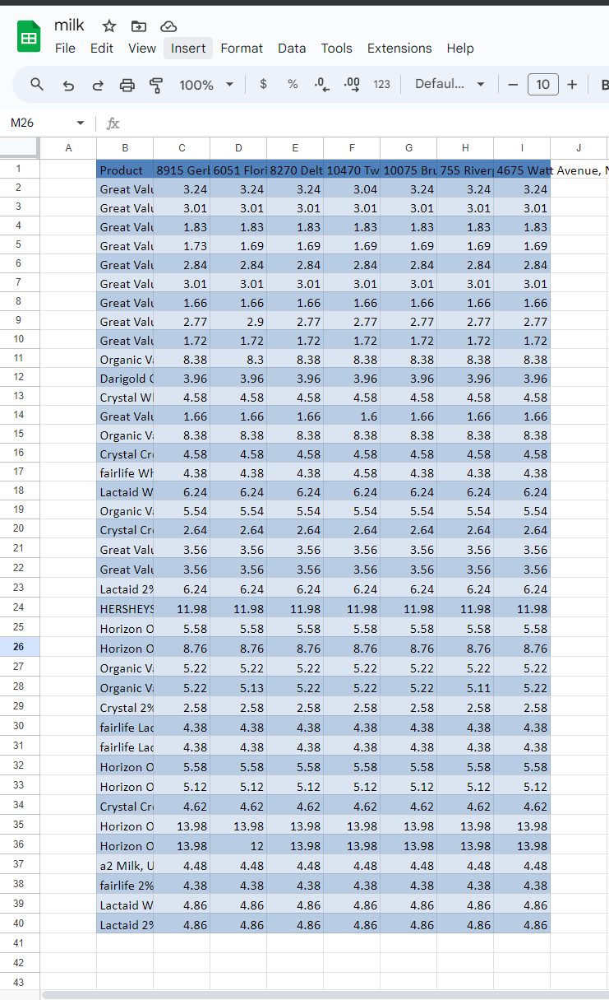

# Walmart-Spreadsheet-Generator
# About
A back-end program based around command prompt used to collect data upon item prices specified via search within Walmarts by proximity to the users location while dumping data into spreadsheets for analysis.

# Purpose
Provide a visualization for item prices across local Walmarts in a standardized spreadsheet format for users to make a well-informed decision where to make purchases based on price variances across locations

# Features
* Automatic price spreadsheet generation for multiple searches
* Streamlined execution due to being based in terminal
* TomTom API geocoding modified for store proximity
* Clean modern data visualization

# Requirements
* Python (See requirements.txt for packages)
* Python Interpreter
* Network Connection
* Terminal
* Program to view .xslx files (Google Spreadsheets recommended)

# Installation and Usage
 1. Download the repository, and extract to desired location
 2. Open terminal and navigate to the directory where the program is installed (ex. cd Path/To/Folder/Walmart_Application)
 3. Now run the command: python Walmartify.py
 4. The program should execute displying a input message showing how to proceed
 
 6. Either enter one of the commands listed or continue by specifying a product
 7. The results are now loaded into the products folder within the document folder of the user
 
 9. Open files for analysis through .xlsx viewer of choice
 
# Technology
## Python
* Used to develop framework of application and utilized to capture API data
## TomTom API
* A free alternative to google map API to find walmart stores by user location
## PostMan 
* A program utilized to make custom calls to Walmart API in a manner to avoid bot detection

# Future and Contributions
The program is finalized but is open-source for further features and I hope it will be used as a tool within other applications contributing to a greater purpose. 
