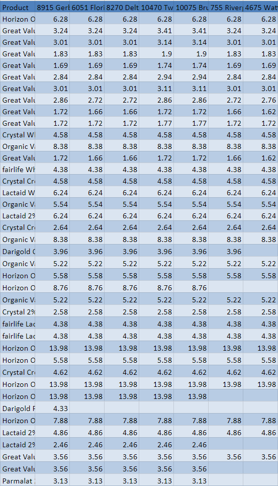

# Walmartify

## About
Walmartify is a robust back-end program, accessible via the command prompt, designed to streamline the collection of item price data from local Walmart stores. This data is retrieved based on user-specified search criteria and proximity to their location. The program organizes this information, allowing users to export it into spreadsheets for analysis. Whether you're a business owner, researcher, or analyst, Walmartify simplifies the task of gathering and managing essential pricing data from local Walmart stores.

## Purpose
The purpose of Walmartify is to offer users a visualization of item prices across Walmart stores located within a set radius. This information is presented in a standardized spreadsheet format, helping users to make well-informed purchasing decisions based on price variations across different store locations. In addition to price data, Walmartify also highlights product availability at various stores, ensuring users can easily locate the items they need. Walmart recently removed the search-by-store feature, making Walmartify even more valuable as it retrieves and presents prices and product availability across multiple nearby stores.

## Features
* Automatically generates spreadsheets for multiple searches, simplifying data organization
* Terminal-based interface for streamlined execution and ease of use.
* TomTom API finds store proximity data for accurate results.
* clean data visualization for ease of analysis.

## Video Showcase

## Requirements
* Python (See requirements.txt for packages)
* Python Interpreter
* Network Connection
* Terminal
* Program to view .xslx files (Google Spreadsheets recommended)

## Installation and Usage
 1. Download the repository and extract its contents.
 2. To install the required packages, navigate to the 'Walmartify/' directory in your terminal and execute the command: pip install -r requirements.txt.
 3. Navigate to the directory where the program is installed, for example, using the command: cd Path/To/Folder/Walmartify/Walmart_Application.
 4. Run the program by executing the command: python Walmartify.py.
 5. The program will execute and display an input message indicating how to proceed.
 
 6. Either enter one of the listed commands or continue by specifying a product.
 7. The results, which will be stored in the 'products' folder located in the user's 'Documents' directory.
 
 8. Open the generated files for analysis using your preferred .xlsx viewer.

  

## Technology
### Python
* Serves as the framework for developing the Walmartify application, and for capturing and processing API data.
### TomTom API
* A cost-effective alternative to the Google Maps API, enabling precise location-based searches for Walmart stores.
### PostMan 
* tool employed to make custom API calls to Walmart's services. This approach is designed to circumvent bot flase-positives.

## Future and Contributions
The program is finalized and open-source, contributions for further enhancements and features are welcome.
